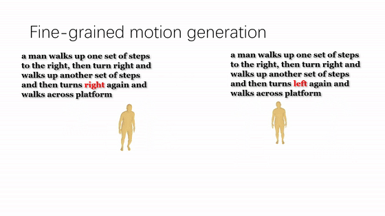

# (ICCV 2023) AttT2M

Code of ICCV 2023 paper: "AttT2M: Text-Driven Human Motion Generation with Multi-Perspective Attention Mechanism"

[[Paper]](https://arxiv.org/abs/2309.00796) [[Bilibili Video]](https://www.bilibili.com/video/BV1Mm4y1K7cw/?vd_source=fba547ec815d2cee49e1b57482ce848b)

The pre-train model and train/eval method are Updated. Please see below for more details.

<p align="center">

</p>

If our paper or code is helpful to you, please cite our paper：
```
@InProceedings{Zhong_2023_ICCV,
    author    = {Zhong, Chongyang and Hu, Lei and Zhang, Zihao and Xia, Shihong},
    title     = {AttT2M: Text-Driven Human Motion Generation with Multi-Perspective Attention Mechanism},
    booktitle = {Proceedings of the IEEE/CVF International Conference on Computer Vision (ICCV)},
    month     = {October},
    year      = {2023},
    pages     = {509-519}
}
```

## 1. Results

### 1.1 Visual Results

### Text-driven motion generation
<p align="center">

</p>

### Compare with SOTA
<p align="center">

</p>

### Generation diversity
<p align="center">

</p>

### Fine-grained generation
<p align="center">

</p>

### 1.2 Quantitative Results

<p align="center">

</p>

 For more results, please refer to our [[Demo]](https://www.bilibili.com/video/BV1Mm4y1K7cw/?vd_source=fba547ec815d2cee49e1b57482ce848b))
## 2. Installation

### 2.1. Environment

```bash
conda env create -f environment.yml
conda activate Att-T2M
```
The code was tested on Python 3.8 and PyTorch 1.8.1.


### 2.2. Datasets and others

We use two dataset: HumanML3D and KIT-ML. For both datasets, the details about them can be found [[here]](https://github.com/EricGuo5513/HumanML3D).   
Motion & text feature extractors are also provided by [t2m](https://github.com/EricGuo5513/text-to-motion) to evaluate our generated motions


## 3. Quick Start
1.First step: Download the pre-train models from [Google Drive](https://drive.google.com/file/d/1UguYU5YSmhOanzPp79AsLxTeyIjPHEZA/view?usp=sharing)
```
pretrain_models/
   ├── HumanML3D/
      ├── Trans/
         ├──net_best_fid.pth
         ├──run.log
      ├── VQVAE/
         ├──net_last.pth
   ├── KIT/
      ├── Trans/
         ├──net_last_290000.pth
         ├──run.log
      ├── VQVAE/
         ├──net_last.pth
```
2. Second step:Download other models from [Google Drive](https://drive.google.com/file/d/1F3MikRtC9IDEIzG5_U2r7qj4vLg1vYuq/view?usp=sharing)

3.Third step:run the visualize script： 
```
python vis.py
```

## 4. Train
Preparation: you need to download the necessary material from Google Drive:[material1](https://drive.google.com/file/d/1F3MikRtC9IDEIzG5_U2r7qj4vLg1vYuq/view?usp=sharing), [material2](https://drive.google.com/file/d/1msoOkokY1uU8kRBpldu_jNudh4-u0jjo/view?usp=sharing)

### 4.1. VQ-VAE 

The VAVAE trian parameters are almost the same as T2M GPT

<details>
<summary>
VQ training
</summary>

```bash
python3 train_vq.py \
--batch-size 256 \
--lr 2e-4 \
--total-iter 300000 \
--lr-scheduler 200000 \
--nb-code 512 \
--down-t 2 \
--depth 3 \
--dilation-growth-rate 3 \
--out-dir output \
--dataname t2m \
--vq-act relu \
--quantizer ema_reset \
--loss-vel 0.5 \
--recons-loss l1_smooth \
--exp-name VQVAE
```

</details>

### 4.2. GPT 

The results are saved in the folder output.

<details>
<summary>
GPT training
</summary>

```bash
python3 train_t2m_trans.py  \
--num_layers_cross 2 \
--exp-name GPT \
--batch-size 128 \
--num-layers 9 \
--embed-dim-gpt 1024 \
--nb-code 512 \
--n-head-gpt 16 \
--block-size 51 \
--ff-rate 4 \
--drop-out-rate 0.1 \
--resume-pth output/VQVAE/net_last.pth \
--vq-name VQVAE \
--out-dir output \
--total-iter 300000 \
--lr-scheduler 150000 \
--lr 0.0001 \
--dataname t2m \
--down-t 2 \
--depth 3 \
--quantizer ema_reset \
--eval-iter 10000 \
--pkeep 0.5 \
--dilation-growth-rate 3 \
--vq-act relu
```

</details>

## 5. Evaluation 

<details>
<summary>
GPT eval
</summary>


```bash
python3 GPT_eval_multi.py  \
--exp-name TEST_GPT \
--batch-size 128 \
--num-layers 9 \
--num_layers_cross 2 \
--embed-dim-gpt 1024 \
--nb-code 512 \
--n-head-gpt 16 \
--block-size 51 \
--ff-rate 4 \
--drop-out-rate 0.1 \
--resume-pth output/VQVAE/net_last.pth \
--vq-name VQVAE \
--out-dir output \
--total-iter 300000 \
--lr-scheduler 150000 \
--lr 0.0001 \
--dataname t2m \
--down-t 2 \
--depth 3 \
--quantizer ema_reset \
--eval-iter 10000 \
--pkeep 0.5 \
--dilation-growth-rate 3 \
--vq-act relu \
--resume-trans output/GPT/net_best_fid.pth
```

Please repalce "--resume-pth" and "--resume-trans" with the VQVAE and Transformer models you want to evaluate.

The evaluation for multimodality will take a long time. So for a quicker evaluation without multimodality, you can comment out line 452 and line 453 in ./utils/eval_trans.py

</details>

## 6. Acknowledgement

* Part of the code is borrowed from public code like [text-to-motion](https://github.com/EricGuo5513/text-to-motion), [T2M-GPT](https://github.com/Mael-zys/T2M-GPT), [MotionDiffuse](https://github.com/mingyuan-zhang/MotionDiffuse) etc.


